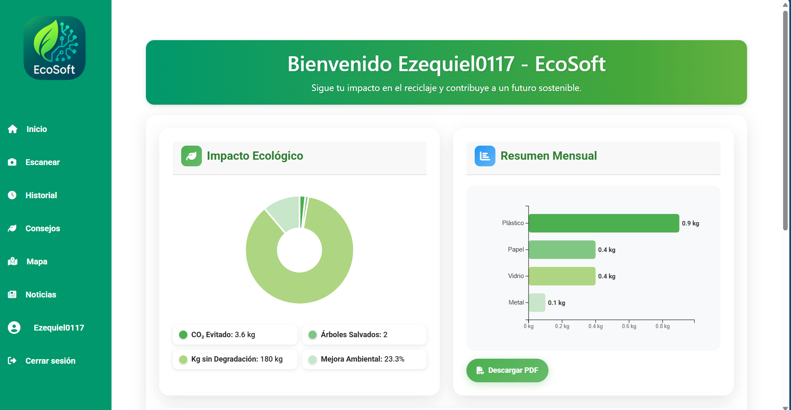
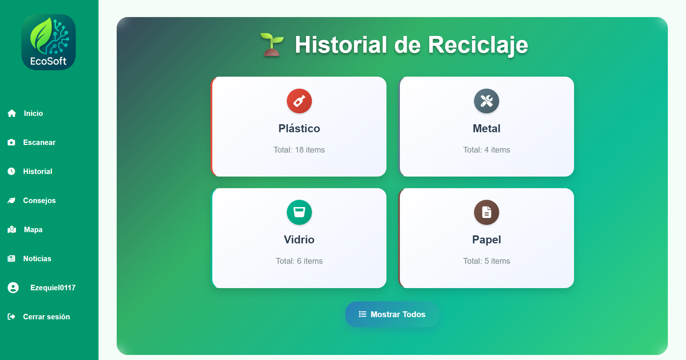
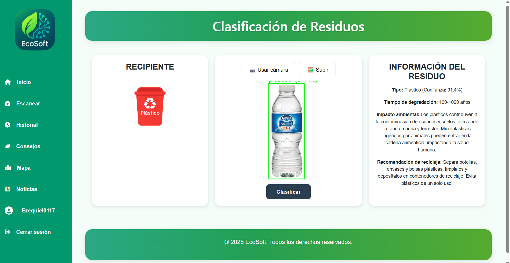
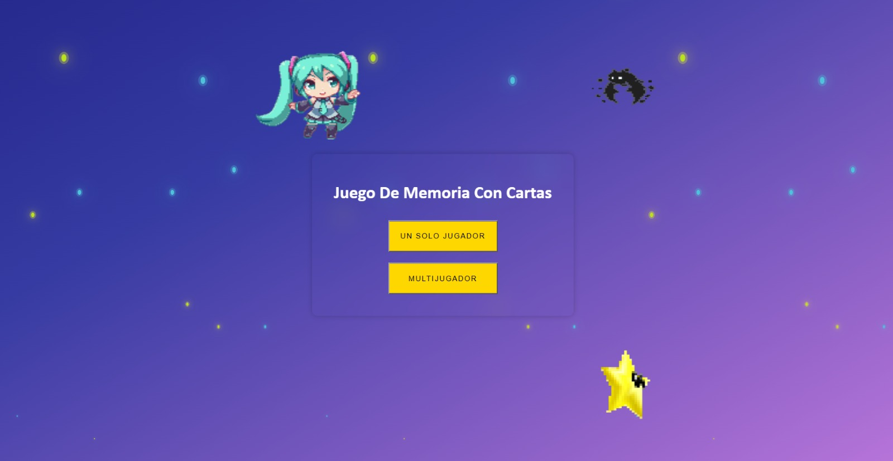
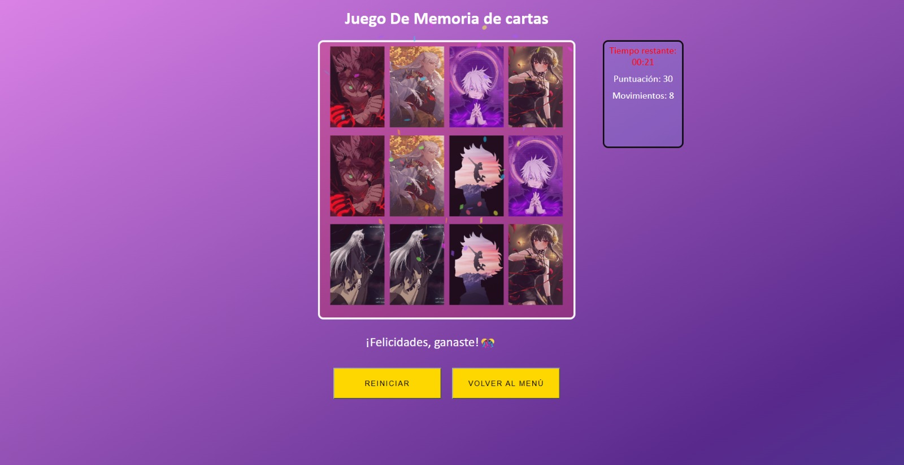
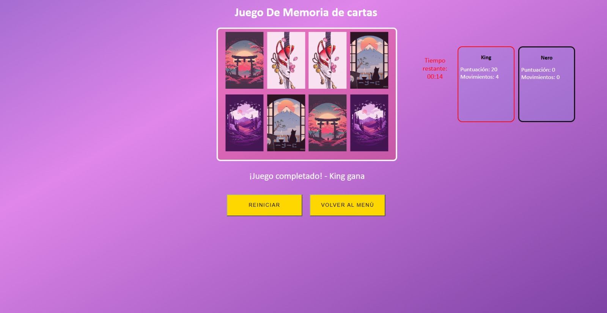
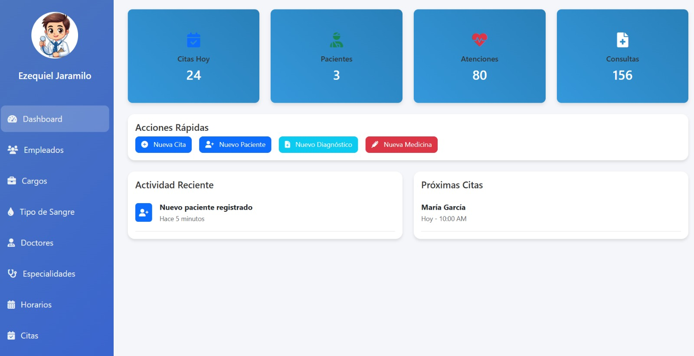
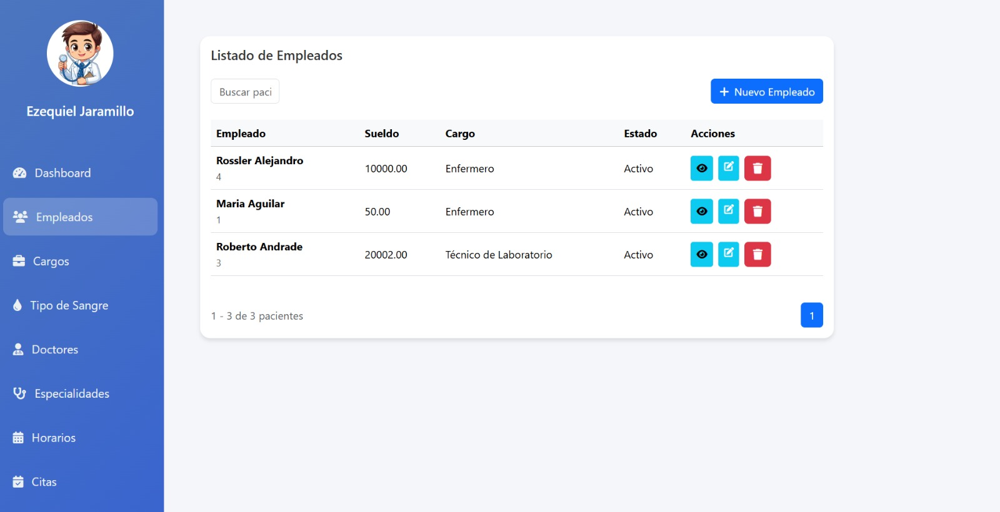
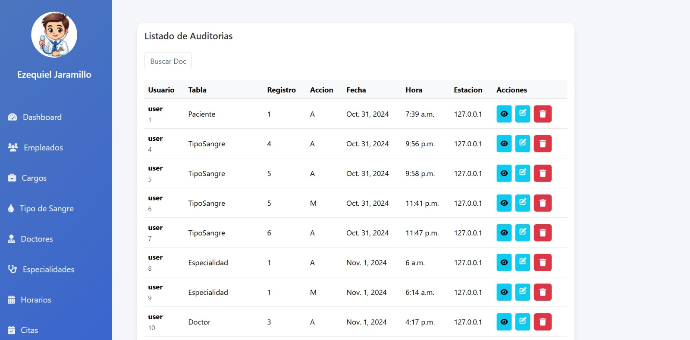

# Ezequiel.dev - Portafolio

Portafolio web personal de Ezequiel, estudiante de Ingeniería de Software. El sitio presenta información profesional, habilidades técnicas y proyectos académicos relacionados con desarrollo web, inteligencia artificial y gestión de sistemas.

## Características

- Diseño responsive para escritorio, tablet y móvil.
- Tema claro y oscuro con preferencia guardada en el navegador.
- Menú de navegación adaptable para dispositivos móviles.
- Tarjetas de proyectos generadas desde JavaScript.
- Carrusel de imágenes para cada proyecto.
- Formulario de contacto con validación básica.
- Página independiente de Design System.

## Tecnologías

- HTML5
- CSS3
- JavaScript
- CSS Custom Properties
- SVG para iconos tecnológicos
- LocalStorage para guardar el tema seleccionado

## Proyectos incluidos

### EcoSoft

Aplicación web inteligente para detectar y clasificar residuos mediante inteligencia artificial. Incluye historial de análisis, métricas, autenticación, dashboard y mapa de puntos de reciclaje.

### Juego de Memoria con Cartas

Juego web con niveles de dificultad, modos individual y multijugador, puntuación, temporizador, sonidos, pausa, reinicio y cartas aleatorizadas.

### Sistema Integral de Gestión Médica

Sistema web para gestionar pacientes, citas, historias clínicas, consultas, facturación, pagos, auditoría y documentos PDF.

## Visualización

El proyecto no requiere instalación de dependencias.

### Opción 1: abrir directamente

Abre `index.html` en un navegador web.

### Opción 2: usar Live Server

1. Abre la carpeta del proyecto en Visual Studio Code.
2. Instala la extensión **Live Server** si todavía no está instalada.
3. Haz clic derecho sobre `index.html`.
4. Selecciona **Open with Live Server**.
5. Para consultar la guía visual, abre `design-system.html`.

## Capturas

### EcoSoft







### Juego de Memoria con Cartas







### Sistema Integral de Gestión Médica







## Estructura principal

```text
PortafolioWeb/
├── index.html
├── design-system.html
├── assets/
│   ├── icons/
│   └── img/
├── css/
│   ├── style.css
│   └── variables.css
├── js/
│   └── main.js
└── README.md
```
